# 学生宿舍管理系统

## 开发环境

**IDE** vscode

**GUI** pyqt5

## 数据库设计

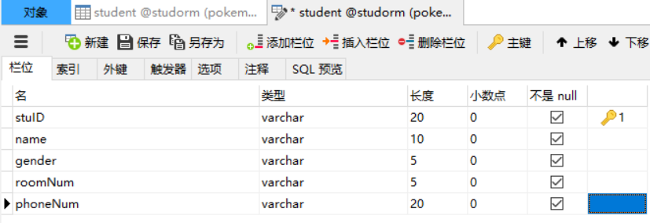

数据库中信息如下

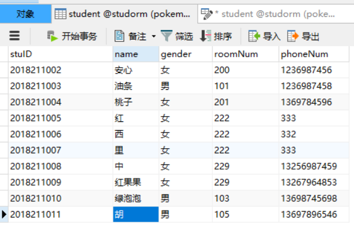

## 功能显示

### 查询信息

输入学号，点击`添加`按钮

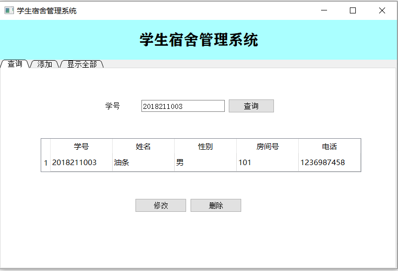

### 修改信息

修改信息，点击`修改`按钮

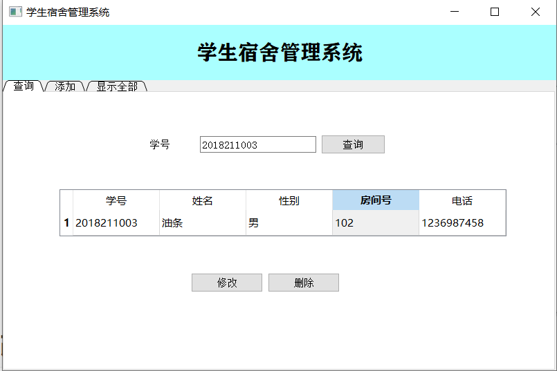

再次点击`查询`按钮

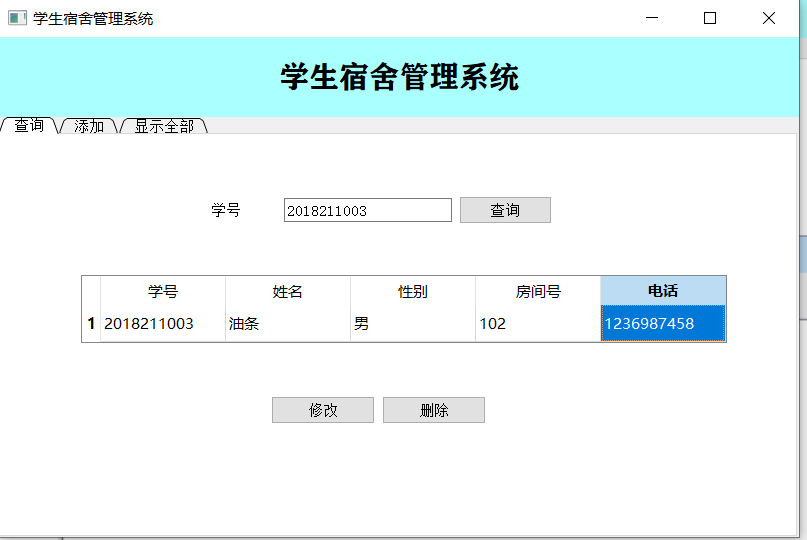

发现信息已修改，同时可以在所有学生信息中看到信息的更新

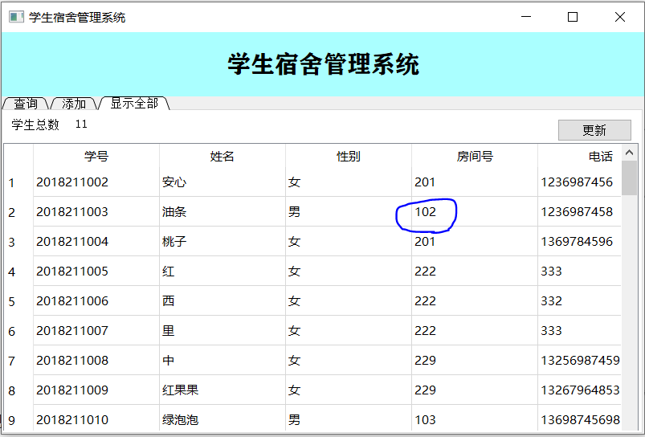

### 删除信息

点击`删除`按钮，删除学生"油条"的信息

可以看到信息已删除

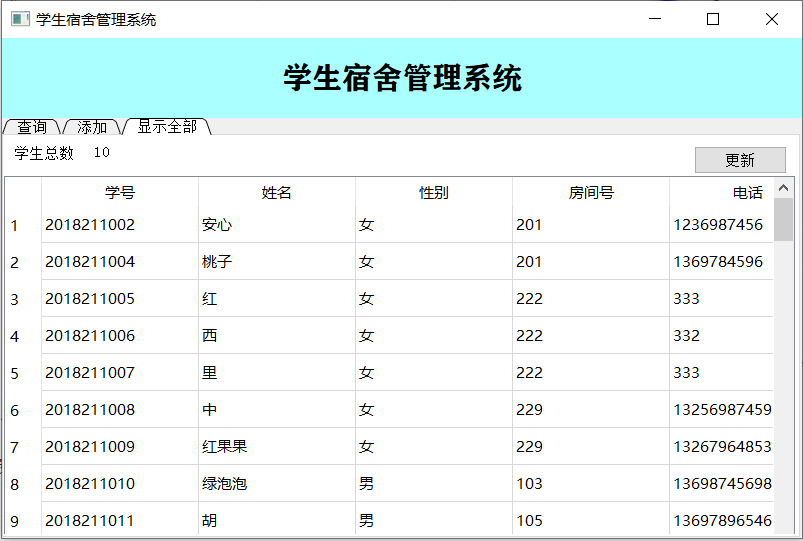

### 添加信息

输入学生信息，点击`添加`按钮，添加一条学生信息

可以在学生信息表中看到已添加的信息

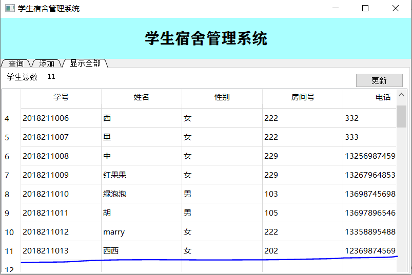

### 显示所有学生信息

点击`更新`按钮，可以得到所有学生的信息，以及学生的总数

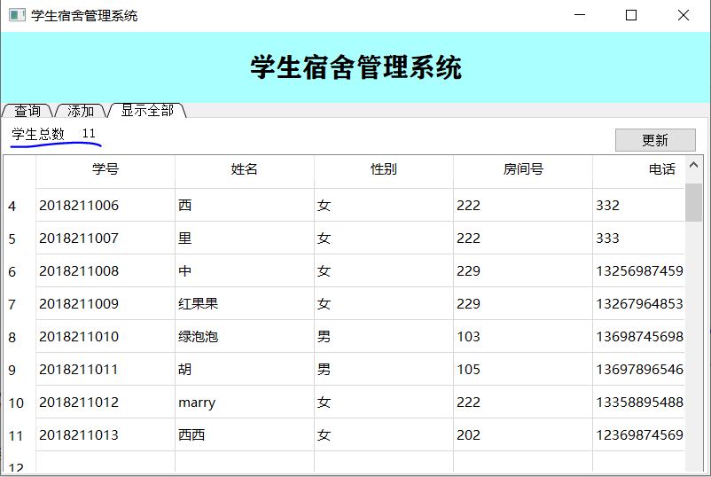

## 错误提示

#### 查询学号不存在

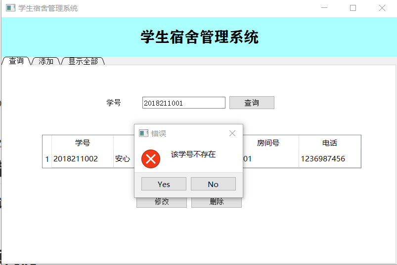

#### 添加学生信息时输入不完整

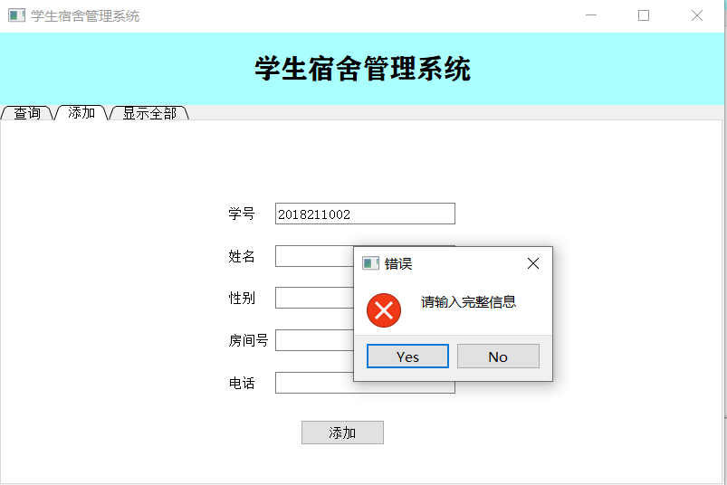

#### 添加学生信息时学号重复

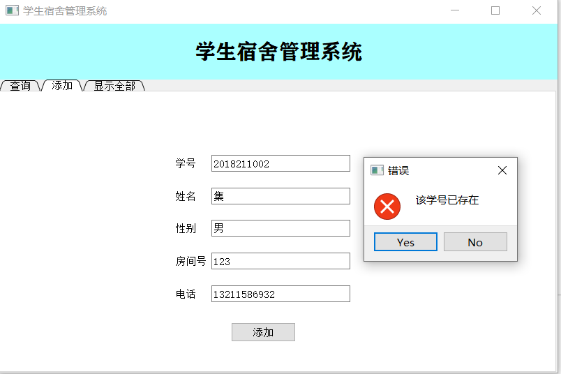

#### 未输入学号就删除信息

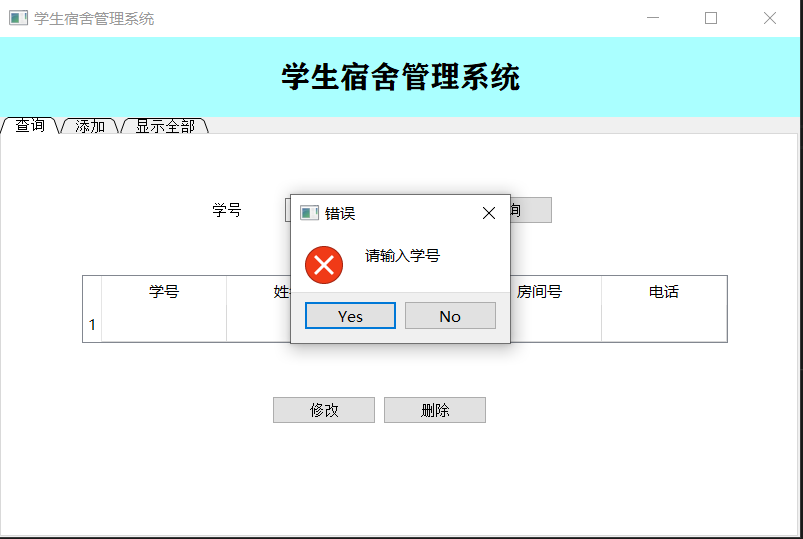

#### 要删除的学号不存在

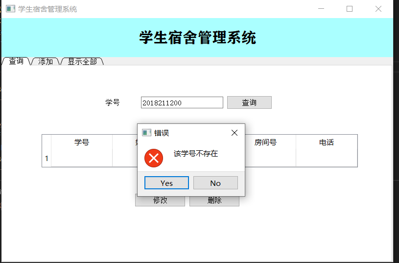

